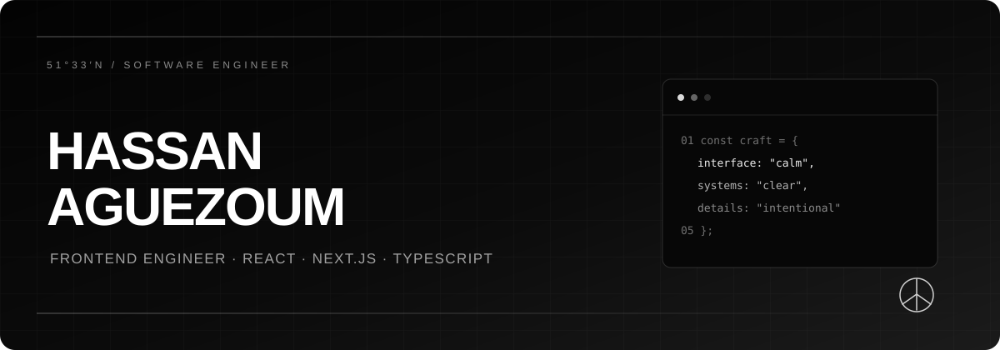
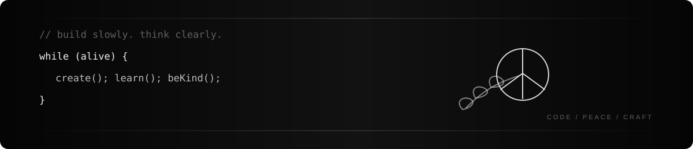

<!-- Minimal black-and-white GitHub profile for @haguezoum -->

<div align="center">
  
</div>

<br>

``Hello World 👋``  I’m **Hassan**, a frontend-focused software engineer and student at [1337](https://1337.ma/). I build calm, responsive products where the **interface meets the API**—with a focus on SaaS dashboards, clear component systems, and maintainable frontend architecture.

```ts
const hassan = {
  focus: ["SaaS", "frontend architecture", "API-driven products"],
  buildingWith: ["React", "Next.js", "TypeScript", "Node.js"],
  values: ["clarity", "curiosity", "craft", "kindness"],
  currentlyLearning: "how to make complex products feel simple",
};
```

<div align="center">
  
</div>

<h3 id="toolbox">TOOLBOX</h3>

<p>
  
  
  
  
  
  
  
  
  
  
</p>

<br>


<h3 id="connect">CONNECT</h3>

I like meeting curious people, trading ideas, and building thoughtful things together.

<p>
  <a href="https://www.linkedin.com/in/hassan-aguezoum/"></a>
  <a href="https://twitter.com/hassan_aguezoum"></a>
  <a href="https://github.com/haguezoum"></a>
  
</p>

<br>

---

<p align="center">
  <samp>THINK LIKE A USER · BUILD LIKE AN ENGINEER · SHIP WITH PEACE</samp>
</p>
